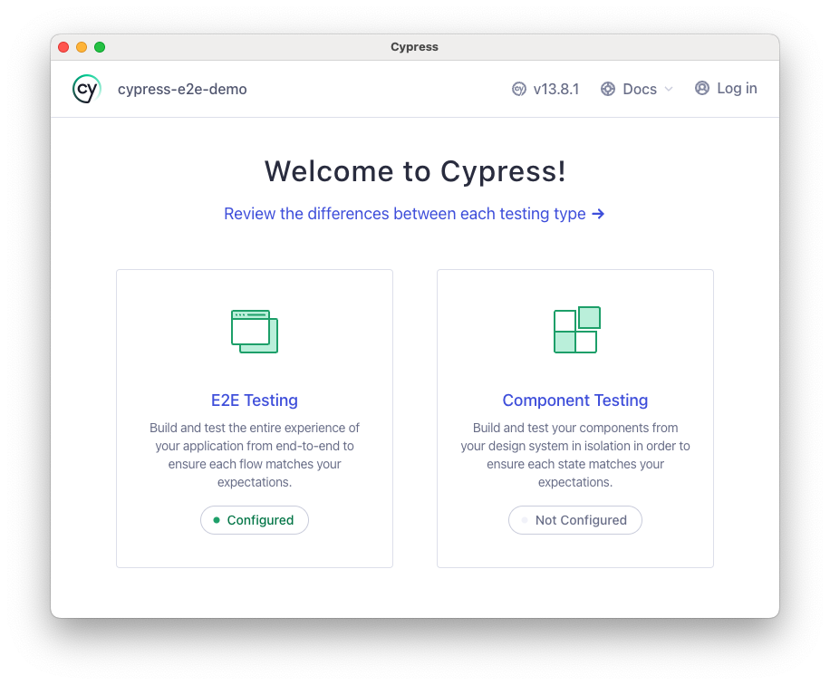
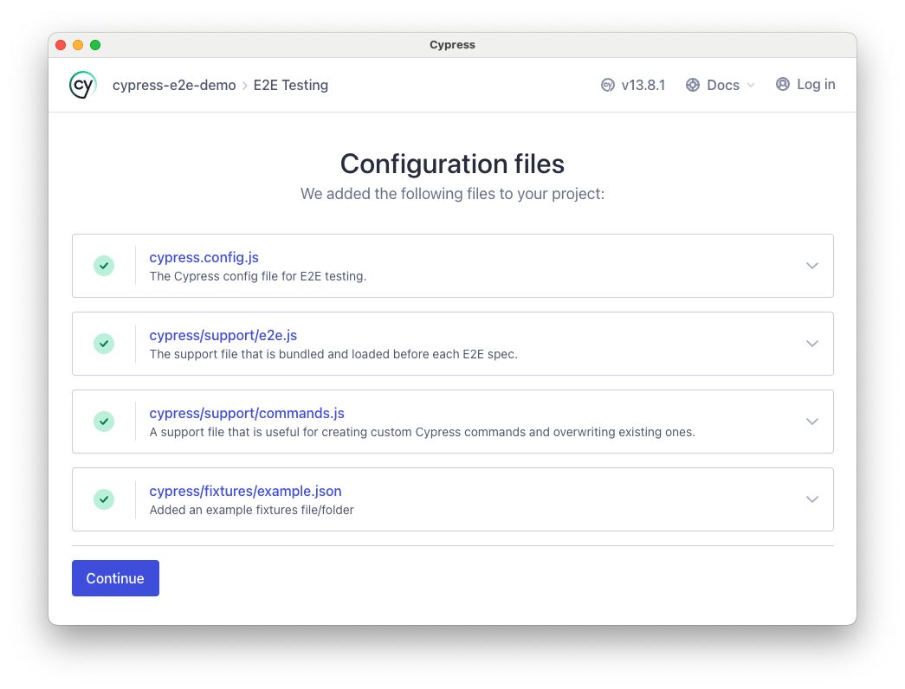
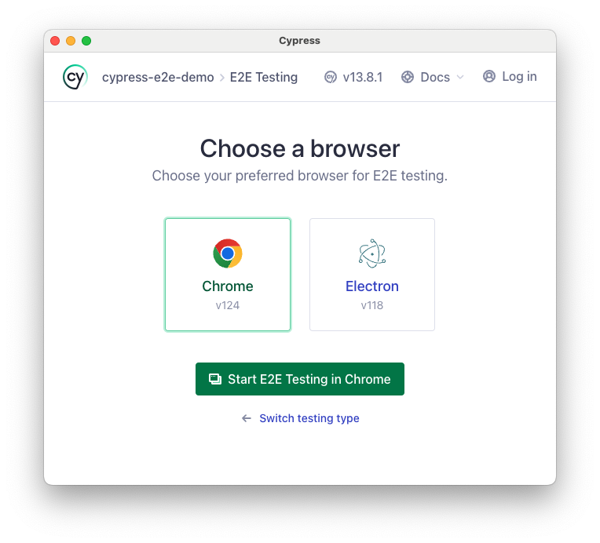
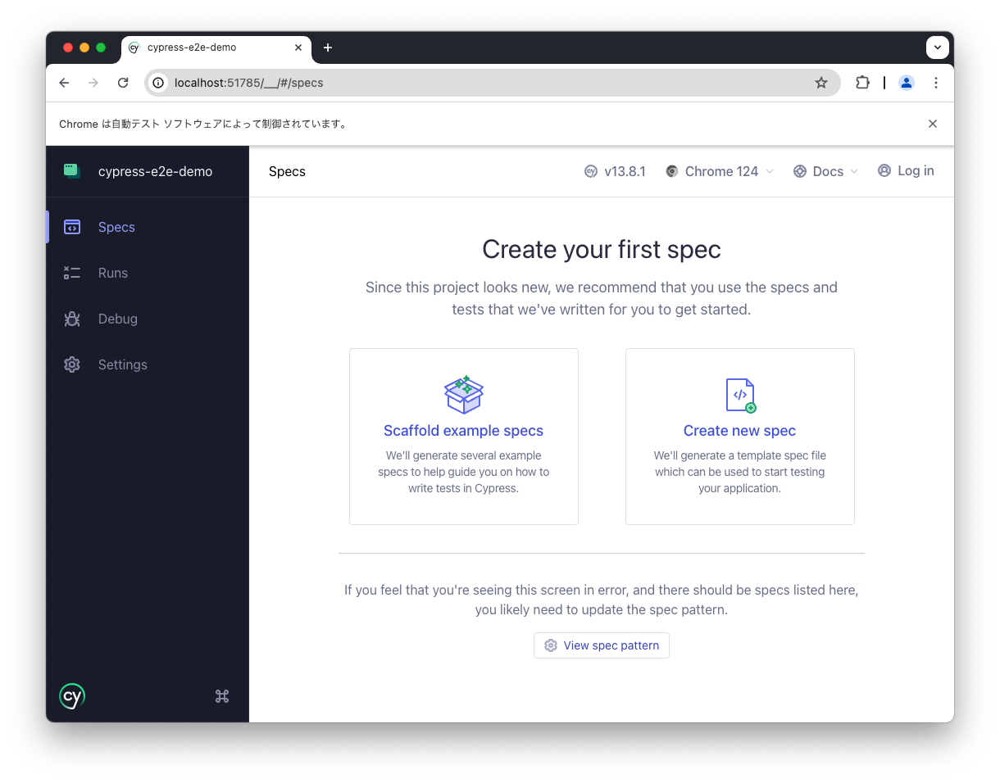
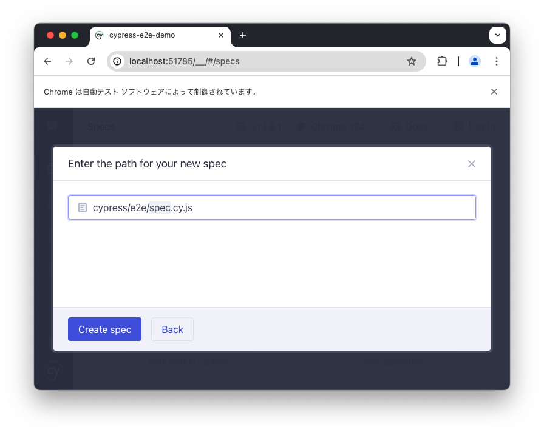
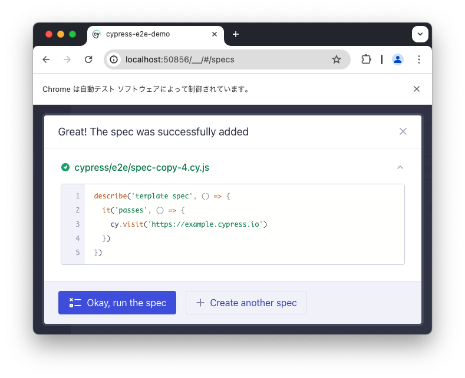
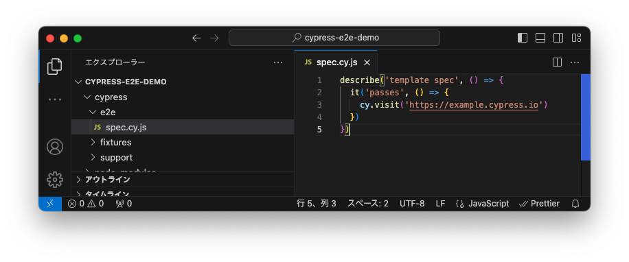

https://docs.cypress.io/
>2024/05/2時点、全角文字を含むディレクトリにプロジェクトを作成するとクラッシュします。


１．新しいパッケージを作成します。
```
yarn init -y
```

２．Cypressをインストール
```
yarn add cypress --dev
```

３．Cypressを開く
```
yarn cypress open
```



４．Continueをクリック


５．Start E2E Testing in Chrome をクリック


６．Create new Spec をクリック


７．Create spec をクリック


８．Okay, run the specをクリック


９．template specのpassesというテストケースが実行され、グリーンになっています。


１０．テストはcypress/e2e/spec.cy.js に記載されています。
